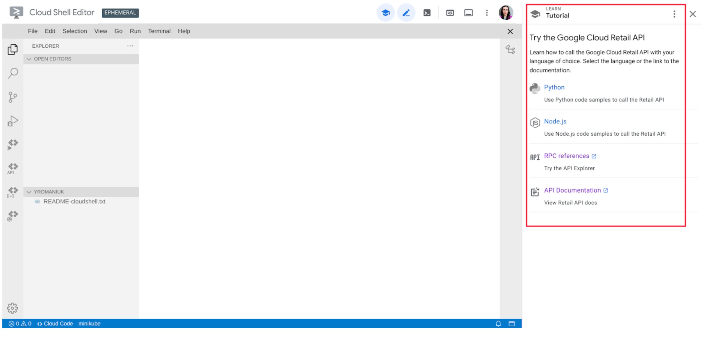
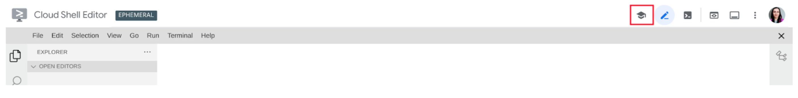
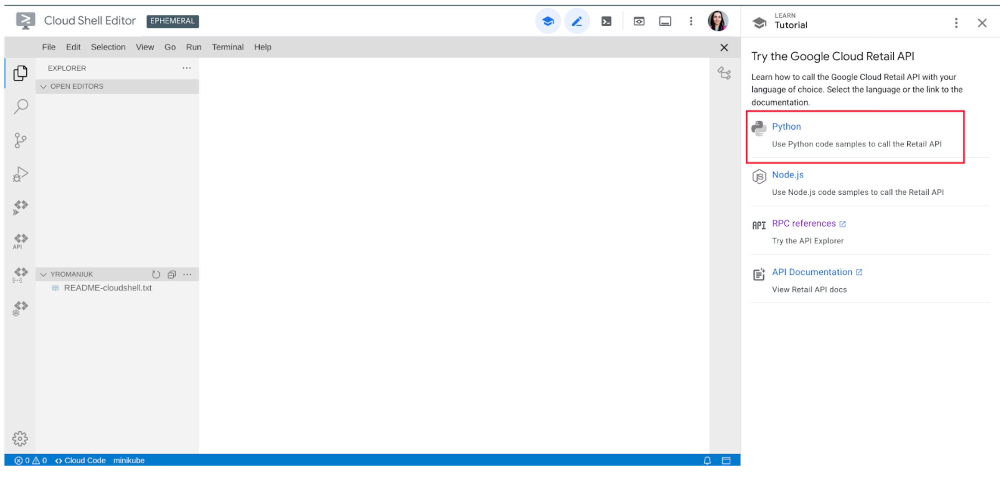
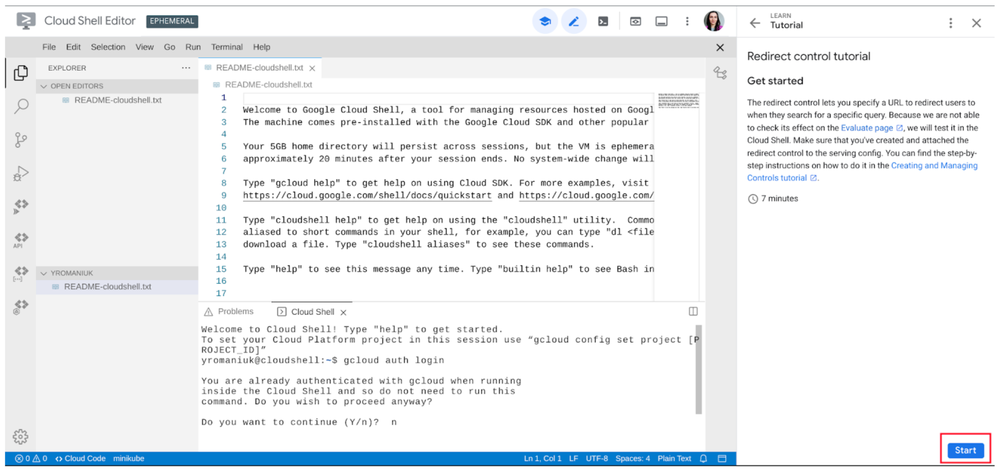

## Get started with Google Cloud Retail


##Run tutorials in Cloud Shell

To advance with the interactive tutorials, use Retail Search step-by-step manuals on the right side of the Cloud Shell IDE: 


The interactive tutorial should open by default. If it didn’t, click on the Tutorial symbol in the menu bar to open the step-by-step manual:


For more details about the Cloud Shell environment, refer to the [Cloud Shell documentation](https://cloud.google.com/shell/docs).

## Interactive tutorial flow

Interactive guides are intended to help you understand the features provided by Google Cloud Retail Search and test the Retail API in action.

To proceed with the tutorial, choose a language you’ll be deploying your project in:



To begin with the tutorial workflow, click the Start button:


Then, you can use Next and Previous buttons to navigate the tutorial pages.

## Get started with the Google Cloud Retail API

The Retail API provides you with the following possibilities to: 
  - Create and maintaining the catalog data. 
  - Fine-tune the search configuration.
  - Import and maintain the user events data.

You can find the information about the Retail services in the [documentation](https://cloud.google.com/retail/docs)

<!--TODO(tkarasova) update the link to the tutorials when will be published-->
If you would like to have a closer look at the Retail API features and try them yourself,
the best option is to use the [Interactive Tutorials](https://cloud.google.com/retail/docs/overview). The tutorials will be launched in the CloudShell environment, and you will be able to request the Retail services and check the response with minimum time and effort.

The code samples in the directory **nodejs-retail/samples/interactive-tutorials** are explicitly created for use with the Retail Interactive Tutorials.

If, for some reason, you have decided to proceed with these code samples without the tutorial, please go through the following steps and set up the required preconditions.

### Select your project and enable the Retail API

Google Cloud organizes resources into projects. This lets you
collect all related resources for a single application in one place.

If you don't have a Google Cloud project yet or you're not the owner of an existing one, you can
[create a new project](https://console.cloud.google.com/projectcreate).

After the project is created, set your PROJECT_ID to a ```project``` variable:

1. Run the following command in the Terminal:

    ```bash
    gcloud config set project <YOUR_PROJECT_ID>
    ```

1. Ensure that the Retail API is enabled for your project in the [API & Services page](https://console.cloud.google.com/apis/api/retail.googleapis.com/).

1.  Log in with your user credentials to run a code sample from the Cloud Shell:

    ```bash
    gcloud auth login
    ```

1.  Type `Y` and press **Enter**. Click the link in the Terminal. A browser window
    should appear asking you to log in using your Gmail account.

1.  Provide the Google Auth Library with access to your credentials and paste
    the code from the browser to the Terminal.

## Prepare your work environment

To prepare the work environment you should perform the following steps:
- Create a service account.
- Create service account key and set it to authorize your calls to the Retail API.
- Install Google Cloud Retail library.

### Create service account

To access the Retail API, you must create a service account. Check that you are an owner of your Google Cloud project on the [IAM page](https://console.cloud.google.com/iam-admin/iam).

1. To create a service account, perform the following command:

    ```bash
    gcloud iam service-accounts create <YOUR_SERVICE_ACCOUNT_ID>
    ```

1. Assign the needed roles to your service account:

    ```bash
    for role in {retail.admin,storage.admin,bigquery.admin}
    do gcloud projects add-iam-policy-binding <YOUR_PROJECT_ID> --member="serviceAccount:<YOUR_SERVICE_ACCOUNT_ID>@<YOUR_PROJECT_ID>.iam.gserviceaccount.com" --role="roles/${role}"
    done
    ```

1. Use the following command to print out the service account email:

    ```bash
    gcloud iam service-accounts list|grep <YOUR_SERVICE_ACCOUNT_ID>
    ```

    Copy the service account email.


1.  Upload your service account key JSON file and use it to activate the service
    account:

    ```bash
    gcloud iam service-accounts keys create ~/key.json --iam-account <YOUR_SERVICE_ACCOUNT_EMAIL>
    ```

    ```bash
    gcloud auth activate-service-account --key-file ~/key.json
    ```

1.  Set the key as the GOOGLE_APPLICATION_CREDENTIALS environment variable to
    use it for sending requests to the Retail API.

    ```bash
    export GOOGLE_APPLICATION_CREDENTIALS=~/key.json
    ```

### Install Google Cloud Retail libraries

To install all the dependencies, run

```
cd cloudshell_open/retail-search-nodejs-samples
npm install
```

### Running the code samples
Samples are in the `search/`, `products/`, `events/` directories.
To execute an individual code sample, invoke `node` with a file as a parameter at the command line prompt, e.g.:

```
node search/search-simple-query.js
```
